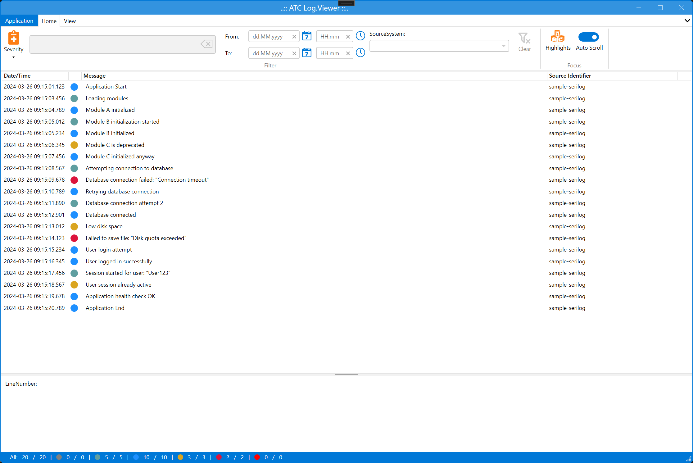

# Atc-logviewer

Atc.LogViewer is a free open source program to receive and view log messages.

Atc.LogViewer for Windows has a live messages view. 

* It can tail files.
* It has helpful color highlighting.
* It has useful message filtering on:
    * term/phrases, 
    * start/end time.


## Features

* Log messages are displayed in real-time (Tail-files)
* File format support:
    * log4net
    * NLog
    * Serilog
* Multi sources (files and folders)
* Drag and drop files and folders from Windows-Explore
* Customizable color highlighting
* Lightweight and very fast
* Run as a Windows application
* Support dark mode
* Auto scroll


| Light-Mode                                                                   | Dark-Mode                                                                    |
|------------------------------------------------------------------------------|------------------------------------------------------------------------------|
| List mode                                     | List mode                                     |
| Graph: Log Level Distribution            | Graph: Log Level Distribution            |
| Graph: Timeline Distribution             | Graph: Timeline Distribution             |


## Microsoft ILogger

| LogLevel    | Value | Method         | Description       |
|-------------|-------|----------------|-------------------|
| Trace       | 0     | LogTrace       | Contain the most detailed messages. These messages may contain sensitive app data. These messages are disabled by default and should not be enabled in production. |
| Debug       | 1     | LogDebug       | For debugging and development. Use with caution in production due to the high volume. |
| Information | 2     | LogInformation | Tracks the general flow of the app. May have long-term value. |
| Warning     | 3     | LogWarning     | For abnormal or unexpected events. Typically includes errors or conditions that don't cause the app to fail. |
| Error       | 4     | LogError       | For errors and exceptions that cannot be handled. These messages indicate a failure in the current operation or request, not an app-wide failure. |
| Critical    | 5     | LogCritical    | For failures that require immediate attention. Examples: data loss scenarios, out of disk space. |
| None        | 6     |                | Specifies that no messages should be written. |

## Examples on default log formats

### log4net

* [Project page to log4net](https://logging.apache.org/log4net/)
* [Github link to log4net](https://github.com/apache/logging-log4net)

#### Supported layout formats:

```csharp
layout = "%date [%thread] %-5level %logger - %message%newline%exception"
```

```text
2024-02-16 09:15:01,123 [8] INFO  Root - Application Start
2024-02-16 09:15:03,456 [8] DEBUG ModuleLoader - Loading modules
2024-02-16 09:15:04,789 [8] INFO  ModuleA - Module A initialized
2024-02-16 09:15:05,012 [8] DEBUG ModuleB - Module B initialization started
2024-02-16 09:15:05,234 [8] INFO  ModuleB - Module B initialized
2024-02-16 09:15:06,345 [8] WARN  ModuleC - Module C is deprecated
2024-02-16 09:15:07,456 [8] INFO  ModuleC - Module C initialized anyway
2024-02-16 09:15:08,567 [8] DEBUG DatabaseConnection - Attempting connection to database
2024-02-16 09:15:09,678 [8] ERROR DatabaseConnection - Database connection failed due to timeout
2024-02-16 09:15:10,789 [8] INFO  DatabaseRetry - Retrying database connection
2024-02-16 09:15:11,890 [8] DEBUG DatabaseConnection - Database connection attempt 2
2024-02-16 09:15:12,901 [8] INFO  Database - Database connected
2024-02-16 09:15:13,012 [8] WARN  SystemCheck - Low disk space
2024-02-16 09:15:14,123 [8] ERROR FileSave - Failed to save file due to disk quota exceeded
2024-02-16 09:15:15,234 [8] INFO  UserAuth - User login attempt
2024-02-16 09:15:16,345 [8] INFO  UserAuth - User logged in successfully
2024-02-16 09:15:17,456 [8] DEBUG SessionManager - Session started for user: User123
2024-02-16 09:15:18,567 [8] WARN  SessionManager - User session already active
2024-02-16 09:15:19,678 [8] INFO  HealthCheck - Application health check OK
2024-02-16 09:15:20,789 [8] INFO  Root - Application End
```

### NLog

* [Project page to NLog](https://nlog-project.org)
* [Github link to NLog](https://github.com/NLog/NLog)

#### Supported layout formats:

```csharp
layout = "${longdate} ${uppercase:${level}} ${message:withexception=true}"
```

```text
2024-02-16 09:15:01.123 INFO Application Start
2024-02-16 09:15:03.456 DEBUG Loading modules
2024-02-16 09:15:04.789 INFO Module A initialized
2024-02-16 09:15:05.012 DEBUG Module B initialization started
2024-02-16 09:15:05.234 INFO Module B initialized
2024-02-16 09:15:06.345 WARN Module C is deprecated
2024-02-16 09:15:07.456 INFO Module C initialized anyway
2024-02-16 09:15:08.567 DEBUG Attempting connection to database
2024-02-16 09:15:09.678 ERROR Database connection failed
2024-02-16 09:15:10.789 INFO Retrying database connection
2024-02-16 09:15:11.890 DEBUG Database connection attempt 2
2024-02-16 09:15:12.901 INFO Database connected
2024-02-16 09:15:13.012 WARN Low disk space
2024-02-16 09:15:14.123 ERROR Failed to save file
2024-02-16 09:15:15.234 INFO User login attempt
2024-02-16 09:15:16.345 INFO User logged in successfully
2024-02-16 09:15:17.456 DEBUG Session started for user
2024-02-16 09:15:18.567 WARN User session already active
2024-02-16 09:15:19.678 INFO Application health check OK
2024-02-16 09:15:20.789 INFO Application End
```

### Serilog

* [Project page to Serilog](https://serilog.net)
* [Github link to Serilog](https://github.com/serilog/serilog)

#### Supported layout formats:

```csharp
layout = "{Timestamp:yyyy-MM-dd HH:mm:ss.fff zzz} [{Level:u3}] {Message}{NewLine}{Exception}"
```

```text
2024-02-16 09:15:01.123 [INF] Application Start
2024-02-16 09:15:03.456 [DBG] Loading modules
2024-02-16 09:15:04.789 [INF] Module A initialized
2024-02-16 09:15:05.012 [DBG] Module B initialization started
2024-02-16 09:15:05.234 [INF] Module B initialized
2024-02-16 09:15:06.345 [WRN] Module C is deprecated
2024-02-16 09:15:07.456 [INF] Module C initialized anyway
2024-02-16 09:15:08.567 [DBG] Attempting connection to database
2024-02-16 09:15:09.678 [ERR] Database connection failed: "Connection timeout"
2024-02-16 09:15:10.789 [INF] Retrying database connection
2024-02-16 09:15:11.890 [DBG] Database connection attempt 2
2024-02-16 09:15:12.901 [INF] Database connected
2024-02-16 09:15:13.012 [WRN] Low disk space
2024-02-16 09:15:14.123 [ERR] Failed to save file: "Disk quota exceeded"
2024-02-16 09:15:15.234 [INF] User login attempt
2024-02-16 09:15:16.345 [INF] User logged in successfully
2024-02-16 09:15:17.456 [DBG] Session started for user: "User123"
2024-02-16 09:15:18.567 [WRN] User session already active
2024-02-16 09:15:19.678 [INF] Application health check OK
2024-02-16 09:15:20.789 [INF] Application End
```

#### LogLevel mapping between Serilog and Ilogger

| Ilogger        |  Serilog      |
|----------------|---------------|
| ***Trace***    | ***Verbose*** |
| Debug          | Debug         |
| Information    | Information   |
| Warning        | Warning       |
| Error          | Error         |
| ***Critical*** | ***Fatal***   |
| *None*         | *None*        |

> Note: Log-level `Trace` vs `Verbose` and `Critical` vs `Fatal`.
